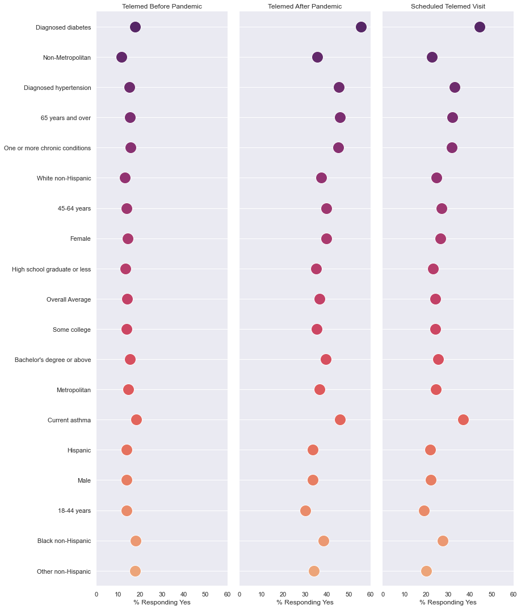
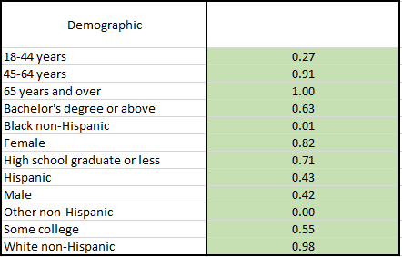
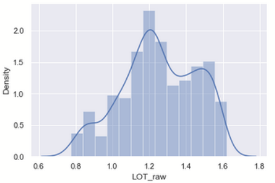
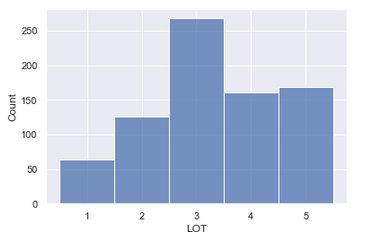
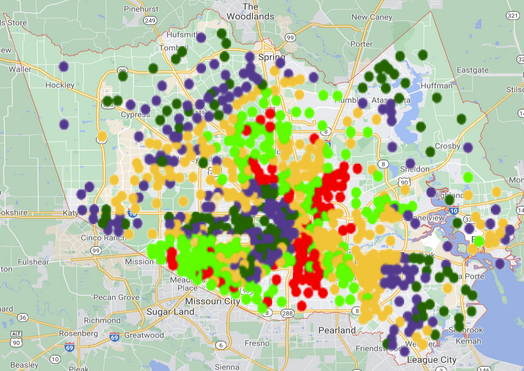
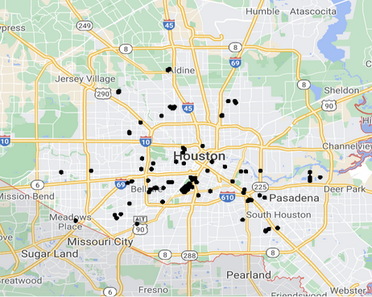

We're making a healthcare data project that even the Teen Titans would guffaw at.

# Titans-Rice-Datathon-2021
Telemedicine is on the rise... who's taking advantage and who's being left behind?

# Overview

Our project was inspired by the relationship between the COVID pandemic and the availability of and affinity toward telemedicine. We noticed that telemedicine literature has increased in quantity over the past decade or so, and looked at the recurring themes in those studies. Noting that different demographics had differing access to telemedicine, we included the extent to which each group scheduled a virtual appointment. We determined which age, race, gender, and education level groups were most likely to seek telemedical services if offered, and then analyzed the presence of those groups in the census tracts of Houston to determine how willing the general population of each tract was to seek them. Of additional interest was the layout of Houston hospitals in comparison to census tracts. We ultimately found an opportunity for identifying areas that could benefit from telemedicine, but are currently underserved.

# Likelihood of Telehealth (LOT) Score

Our team developed a metric measuring how likely people in a census tract would be to use available telemedicine services. 

The LOT score is initially calculated as a weighted sum of available demographic trends in the tract. This is a continuous variable and it is referred to as the “raw” LOT score. We computed a total of 12 distinct demographic weights based on data collected from the CDC’s June 2020 survey of telemedicine usage. The weight for each demographic category measures the likelihood of that demographic using telemedicine services if offered. It is calculated by dividing the % increase of telehealth availability by the % of survey respondents who scheduled a telehealth visit. The raw LOT score is then computed by multiplying each demographic weight by the percentage of the tract population identifying with a demographic. 

To arrive at our final LOT score, we segmented continuous raw LOT scores into 5 distinct categorical bins labeled 1-5. The population in tracts with a LOT score of 5 are more likely to use available telemedicine services compared to a tract with a LOT score of 1. Please refer to the following graph to view the transformation of raw LOT scores to the final LOT score. 

# Telemedicine in Houston

Are there any trends in telemedicine usage across the Houston metropolitan area. We plotted the location of each Houston census tract colored by their LOT score. Darker colors represent higher LOT scores which means the population of the tract is more likely to use telemedicine services, if offered. 

Generally, we noticed that populations further from the city center are more likely to use telehealth services and we see circular trends of increasing LOT scores moving further from the city center. We then examined the location of Houston hospitals.

Hospitals are more sparse on the outskirts of the city where we also see higher LOT scores. There is also a high density of hospitals near the city center, where we see lower LOT scores. It appears telemedicine options become more important when there are fewer hospitals for residents to visit. 
